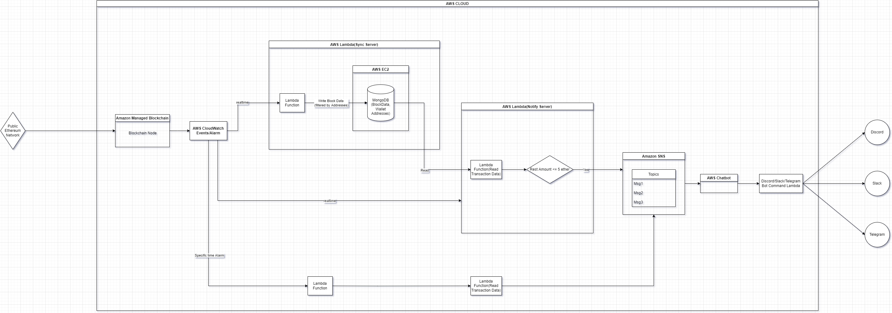

# Welcome to ETH amount notification

1. Architect the system
2. Write a code snippet to detect when a transaction is sent from an Ethereum account and get the current balance of the account at that time

# Servers

1. **Diagram** of system architecture using AWS
2.  **Sync Server** & **Notify Server**

## System Architecture



**Cloud Service** : Amazon Web Service(Lambda, EC2, AWS SNS)

**Blockchain Node** : Amazon Managed Blockchain Node

**Database** : MongoDB (on AWS EC2)

## Sync Server (AWS Lambda)

- Responsible for **monitoring** etherscan for new block.
- Filter transaction data in block by wallet addresses
- Store transaction data into MongoDB.
- Log history

## Notify Server (AWS Lambda)

- Read transaction data from MongoDB in realtime
- Get Balances with walletaddresses
- Notify by rules(Rest amount <= 5 eth)
- Notify at specific time. (daily based)


<br/>
<br/>

## Another approach(Easy but Heavy Perfermance)

- It's easy way to use external services providing RPC node and apis like Alchemy, Infura.
In this case, workflow is like following
 **eth_blockNumber**(API Calling) ->  **eth_getBlockByNumber**(API Calling) -> **eth_getTransactionByHash** (API Calling) -> **Filter Address tx occurred** -> **eth_getBalance**(API calling) -> **Notify**

- Code Snippet(Laravel code I built before.)
```
class InfuraService implements EthService
{
    private $rpcClient;
    private $converter;

    public function __construct()
    {
        $network = config('infura.network');
        $id = config('infura.id');
        $this->rpcClient = Client::factory("https://{$network}.infura.io/v3/{$id}");
        $this->converter = new Converter();
    }

    public function getBalance(string $address): ?string
    {
        $response = $this->rpcClient->send($this->rpcClient->request(1, 'eth_getBalance', [$address, 'latest']));
        return EthHelper::getWeiFromHexDec($response->getRpcResult());
    }

    public function getTransaction(string $transactionHash)
    {
        $request = $this->rpcClient->send(
            $this->rpcClient->request(2, 'eth_getTransactionByHash', [$transactionHash])
        );
        return $request->getRpcResult();
    }

    public function getHistory(string $address): array
    {
        // TODO: Implement getHistory() method.
        return [];
    }

    public function getBlock(string $blockHash) :?array
    {
        $req = $this->rpcClient->send(
            $this->rpcClient->request(3, 'eth_getBlockByHash', [$blockHash, true])
        );

        return $req->getRpcResult();
    }
}
```